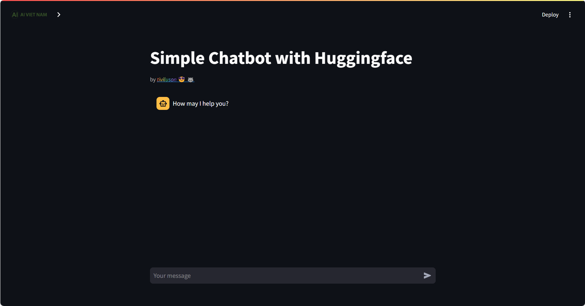
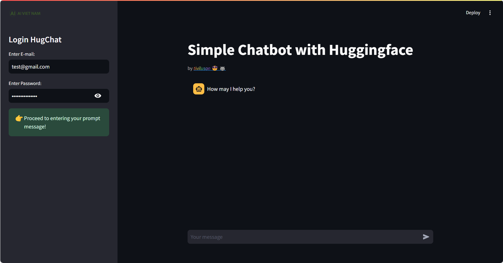
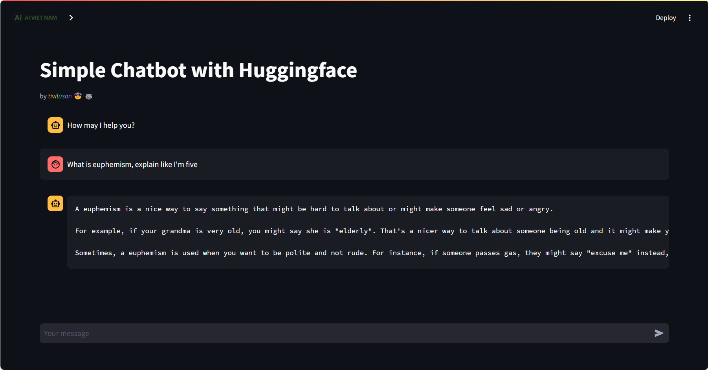

# Hugging Face Chatbot Streamlit App

## Overview
Welcome to the repository of our Streamlit app that integrates a sophisticated chatbot powered by a Hugging Face model. This app provides an interactive interface for users to converse with the chatbot, which is capable of understanding and responding to a wide range of topics.

## Model
The chatbot is built on the Hugging Face's transformer models, which are state-of-the-art machine learning models for natural language processing tasks. The model has been fine-tuned for conversational use cases, providing a seamless chatting experience.

## Getting Started

### Installation
1. Clone the repository:
   ```bash
   git clone https://github.com/tiviluson/Sample-Projects-with-Streamlit
1. Navigate to the directory of the *specific* project
   ```bash
   cd Chat_bot
1. (Optional) Create and activate a virtual environment:
   * For Unix/macOS:
      ```bash
      python -m env .venv
      source .venv/bin/activate
   * For Windows:
      ```bash
      python -m venv venv
      .\venv\Scripts\activate
1. Install the required packages:
   ```bash
   pip install -r requirements.txt
1. Navigate to the project root directory:
   ```bash
   cd ..
1. Run the application
   ```bash
   streamlit run Chat_bot/main.py
   ```
   

### Usage
Once the application is running, open your web browser and go to `http://localhost:8501`. 
Open the left sidebar and enter your HuggingFace's credentials. If you don't have one, sign up [here](https://huggingface.co/join)

After signing in, type your question to the chatbot, press Enter to get a response.


### Limitation
Currently this project does not support conversation mode, which means the chatbot doesn't have recollection of past information exchange.