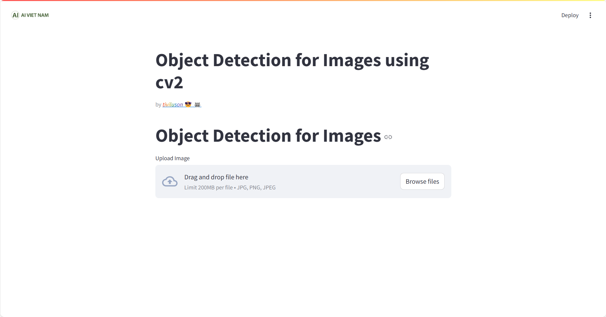
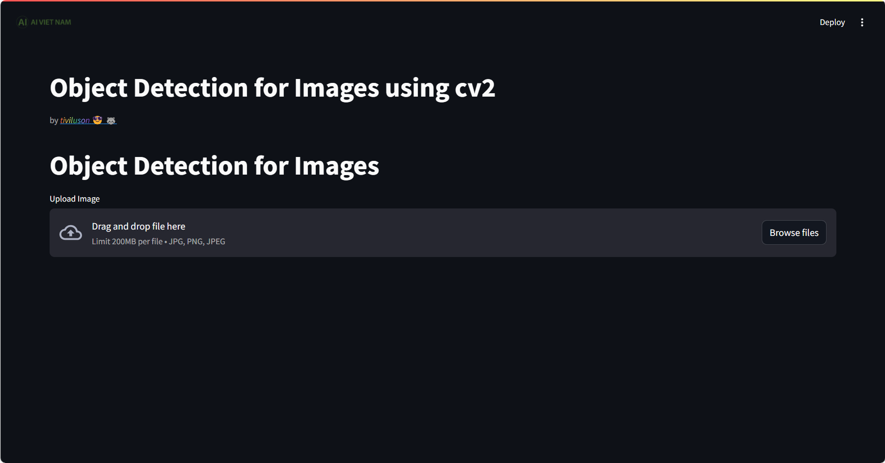
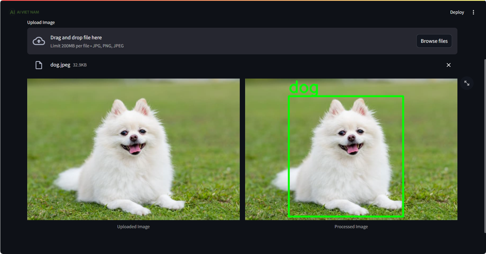

# Object Detection Streamlit App

## Overview
This repository contains a Streamlit application that allows users to perform object detection on their uploaded images. The app utilizes the MobilenetSSD_deploy model, which is trained on the VOC0712 dataset comprising 21 classes.

## Model
The MobilenetSSD_deploy model is a lightweight neural network designed for mobile and embedded vision applications. It is trained to detect objects belonging to 21 different classes, such as animals, vehicles, and everyday items.

## Getting Started

### Installation
1. Clone the repository:
   ```bash
   git clone https://github.com/tiviluson/Sample-Projects-with-Streamlit
1. Navigate to the directory of the *specific* project
   ```bash
   cd Object_detection
1. (Optional) Create and activate a virtual environment:
   * For Unix/macOS:
      ```bash
      python -m env .venv
      source .venv/bin/activate
   * For Windows:
      ```bash
      python -m venv venv
      .\venv\Scripts\activate
1. Install the required packages:
   ```bash
   pip install -r requirements.txt
1. Navigate to the project root directory:
   ```bash
   cd ..
1. Run the application
   ```bash
   streamlit run Object_detection/main.py
   ```
   
   There are also options for layout and theme that can be found in **Setiing**
   

### Usage
Drop an image (*.jpeg*, *.jpg*, *.png*) from your local drive and all classes will be automatically annotated.
