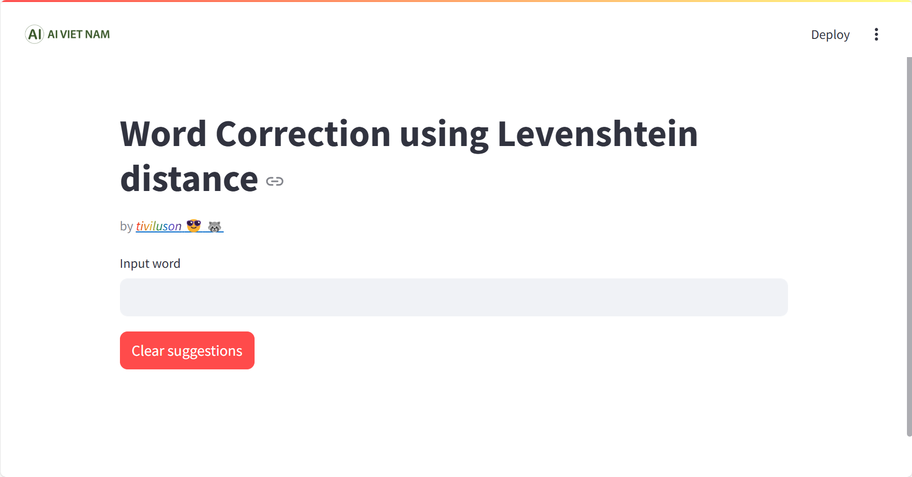
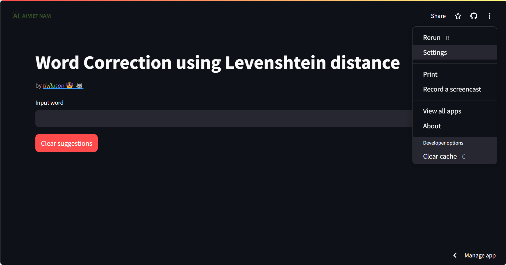
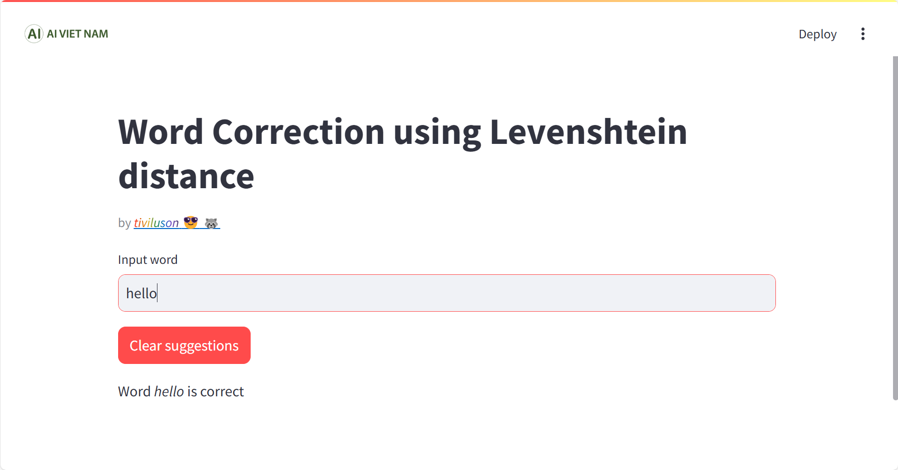
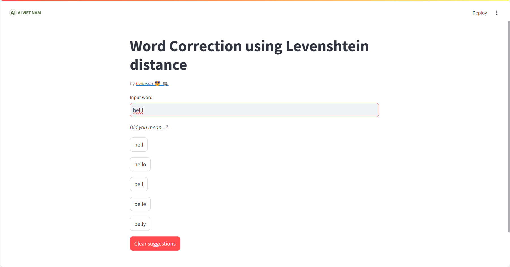

# Streamlit Word Corrector

## Introduction
Welcome to the Streamlit Word Corrector application! This project is designed to help users correct their misspelled words by using the Levenshtein distance algorithm. The application is built with Streamlit, which allows for a clean and interactive web interface.

## Features
- **Interactive UI**: Easy-to-use web interface built with Streamlit.
- **Levenshtein Distance Algorithm**: Implement the algorithm to find the closest match to the input word from a dictionary.
- **Clickable suggestions**: Get your word corrected at the ease of a click

## Live application
You can also visit the live application at [word-correction-tiviluson.streamlit.app](https://word-correction-tiviluson.streamlit.app)

## Getting Started

### Installation
1. Clone the repository:
   ```bash
   git clone https://github.com/tiviluson/Sample-Projects-with-Streamlit
1. Navigate to the directory of the *specific* project
   ```bash
   cd Word_correction
1. (Optional) Create and activate a virtual environment:
   * For Unix/macOS:
      ```bash
      python -m env .venv
      source .venv/bin/activate
   * For Windows:
      ```bash
      python -m venv venv
      .\venv\Scripts\activate
1. Install the required packages:
   ```bash
   pip install -r requirements.txt
1. Navigate to the project root directory:
   ```bash
   cd ..
1. Run the application
   ```bash
   streamlit run Word_correction/main.py
   ```
   
   There are also options for layout and theme that can be found in **Setiing**
   

### Usage
Once the application is running, open your web browser and go to `http://localhost:8501`. Type a word into the input box, and the application, press Enter.
If there is no typo in the word, it should notify that the word is *correct*.

If a typo is detected, it will suggest interactive corrections.
